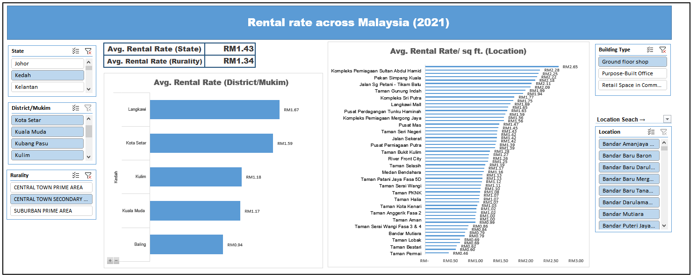

# msia_rental_rate_2021
This was one of my projects during my internship in Pos Malaysia as a New Initiative intern. 
New Initiative Team is created to diversify Pos Malaysia's portfolio, identify new potential revenue stream and scaling it. 
The current project that the New Initiative Team is currently (as of 2022) working on how to monetize the underutilized space in each post office outlets across Malaysia.
Our team is not only aim to become a landlord but to form a strategic partnership with other retailers from different categories ranging from Pharceutical, Convenience Store, to Healthscreening etc.
Hence, the purpose of this Rental Rate Dashboard allows my team and I to make strategic decision on negotiation of the commercial terms between Pos Malaysia and other businesses.

This dashboard is created using Microsoft Excel, and the users can identify the location of interest by filtering states, districts, building types, rurality using the sliders or search the particular location at the "Location Search" button. 

This dashboard can display the average rental rate of the selected state, districts, rurality, building type and location all at the same time!

Data Source: 
https://napic.jpph.gov.my/portal/web/guest/publication?p_p_id=ViewPublishings_WAR_ViewPublishingsportlet&p_p_lifecycle=0&p_p_state=normal&p_p_mode=view&p_p_col_id=column-1&p_p_col_count=2&_ViewPublishings_WAR_ViewPublishingsportlet_action=renderReportListingScreen&publishingId=11474&pageno=1
